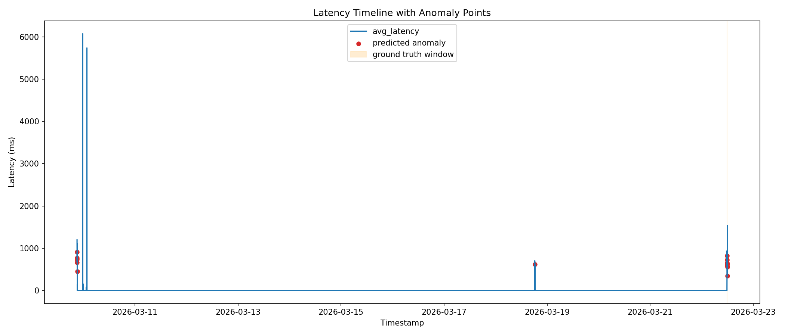
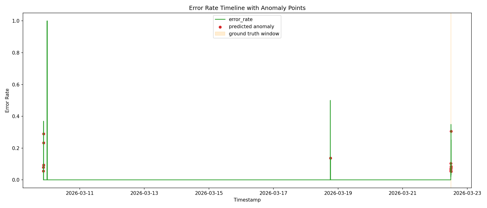

# AIOps Observability Lab

A production-style observability experiment built using a Laravel API that emits ML-ready telemetry and integrates with a full monitoring stack (Prometheus + Grafana).

The system simulates realistic production behavior, generates structured logs, exposes RED metrics, and runs a controlled traffic experiment with anomaly injection to produce datasets suitable for AIOps analysis.

---


## System Architecture

The observability stack is deployed using Docker Compose and consists of four main components:

| Component | Technology | Role |
|---|---|---|
| API Service | Laravel 10 + PHP 8.2 | Handles requests and emits structured telemetry |
| Metrics Backend | Prometheus | Scrapes `/api/metrics` and stores time-series metrics |
| Visualization | Grafana | Displays monitoring dashboards |
| Traffic Generator | Python (aiohttp) | Generates controlled load and anomaly injection |

All services run on a shared Docker network.

---

## Key Features

### Structured Telemetry Logging
Each request generates a structured JSON log containing 17 standardized fields including:

- correlation ID (`request_id`)
- request latency (`latency_ms`)
- error category
- HTTP status
- request metadata
- build version
- host information

Logs are written to:

```
api/storage/logs/aiops.log
```

and later exported as a machine-learning dataset.

---

### Correlation IDs

Every request receives a unique `X-Request-Id`.

- If provided by the client → reused
- If missing → generated automatically (UUID v4)

This allows request tracing across distributed systems.

---

### Centralized Error Categorization

All failures are normalized into five categories:

| Category | Trigger |
|---|---|
| VALIDATION_ERROR | Request validation failure |
| DATABASE_ERROR | Database query failure |
| SYSTEM_ERROR | Runtime exceptions |
| TIMEOUT_ERROR | Latency greater than 4000ms |
| UNKNOWN | Unexpected errors |

This structure simplifies anomaly detection and ML analysis.

---

## API Endpoints

The API exposes multiple endpoints designed to simulate different behaviors.

| Endpoint | Description |
|---|---|
| `GET /api/normal` | Fast successful response |
| `GET /api/slow` | Delayed response (1–2 seconds) |
| `GET /api/slow?hard=1` | Heavy latency (5–7 seconds) |
| `GET /api/error` | Always throws a runtime exception |
| `GET /api/random` | Random mix of responses |
| `GET /api/db` | Executes a SQLite query |
| `GET /api/db?fail=1` | Simulated database failure |
| `POST /api/validate` | Request validation testing |
| `GET /api/metrics` | Prometheus metrics endpoint |
| `POST /api/anomaly-window?active=1|0` | Toggles anomaly ground-truth marker |

---

## Prometheus Metrics

Metrics are exposed through:

```
GET /api/metrics
```

### Available Metrics

| Metric | Type | Purpose |
|---|---|---|
| `http_requests_total` | Counter | Total requests handled |
| `http_errors_total` | Counter | Errors grouped by category |
| `http_request_duration_seconds` | Histogram | Latency distribution |
| `anomaly_window_active` | Gauge | Ground-truth anomaly marker |

Histogram buckets:

```
0.05, 0.1, 0.25, 0.5, 1, 2.5, 5, 10, +Inf
```

---

## Grafana Dashboard

The monitoring dashboard includes five observability panels:

1. Request rate per endpoint
2. Error rate percentage
3. Latency percentiles (P50 / P95 / P99)
4. Error category distribution
5. Anomaly window marker

Dashboard configuration is stored in:

```
grafana_dashboard.json
```

---

## Traffic Generator & Anomaly Experiment

The Python traffic generator simulates production load and injects controlled anomalies.

Run:

```bash
python traffic_generator.py
```

### Base Traffic Distribution

| Endpoint | Traffic Share |
|---|---|
| normal | 70% |
| slow | 15% |
| slow-hard | 5% |
| error | 5% |
| db | 3% |
| validate | 2% |

### Anomaly Window

During a **2-minute anomaly window**, the system injects an error spike:

```
/api/error increases from 5% → 40%
```

Ground truth timestamps are stored in:

```
ground_truth.json
```

---

## Dataset Export

After running the traffic generator, logs can be converted into a structured dataset.

Run:

```bash
php export_logs.php
```

This parses:

```
api/storage/logs/aiops.log
```

and exports:

```
logs.json
```

Schema validation ensures all 17 fields are present in every record.

---

## Running the Project

### Build and Start the Stack

```bash
docker-compose up --build
```

### Access Services

| Service | URL |
|---|---|
| API | http://localhost:8000 |
| Prometheus | http://localhost:9090 |
| Grafana | http://localhost:3000 |

Grafana credentials:

```
admin / admin
```

---

## Repository Structure

```
aiops-observability-lab
│
├── api/
│   └── storage/logs/aiops.log
│
├── docker-compose.yml
├── prometheus.yml
├── grafana_dashboard.json
├── traffic_generator.py
├── export_logs.php
│
├── logs.json
├── ground_truth.json
└── engineering_report.md
```

---

## Deliverables

The repository includes the following artifacts:

- Structured telemetry logs (`aiops.log`)
- ML dataset (`logs.json`)
- Ground truth anomaly dataset (`ground_truth.json`)
- Monitoring configuration (`prometheus.yml`)
- Grafana dashboard (`grafana_dashboard.json`)
- Traffic generator (`traffic_generator.py`)
- Engineering report (`engineering_report.md`)

---

## Lab Work 2: AIOps Detection Engine

Lab Work 2 adds active anomaly detection on top of the observability stack from Lab Work 1.

The detector is implemented as a long-running Artisan command:

```bash
cd api
php artisan aiops:detect --interval=20
```

### What the detector does each cycle

1. Queries Prometheus metrics per endpoint
2. Updates baseline behavior per endpoint (EMA)
3. Detects multi-signal anomalies
4. Correlates signals into one high-level incident
5. Saves incidents to JSON
6. Emits deduplicated alerts

### Detection Components

| Requirement | Implementation |
|---|---|
| Detection command | `api/app/Console/Commands/AIOpsDetect.php` |
| Prometheus API client | `api/app/Services/PrometheusClient.php` |
| Baseline modeling | `api/app/Services/BaselineComputer.php` |
| Multi-signal anomaly rules | `api/app/Services/AnomalyDetector.php` |
| Event correlation | `api/app/Services/EventCorrelator.php` |
| Incident generation | `api/app/Services/IncidentManager.php` |
| Alerting + deduplication | `api/app/Services/AlertManager.php` |

### Incident and Alert Artifacts

- Incidents: `api/storage/aiops/incidents.json`
- Alerts: `api/storage/aiops/alerts.json`
- Alert fingerprints: `api/storage/aiops/alerted_fingerprints.json`
- Baselines: `api/storage/aiops/baselines.json`

### Engineering Report

Lab Work 2 report is available at:

- `engineering_report.md`

It explains:

- baseline design
- anomaly detection rules
- event correlation strategy
- alert suppression logic

### How to demo Lab 2 in 3 minutes

1. Start the stack

```bash
docker-compose up -d
```

Expected output (example):

```text
... app-1         Up
... prometheus-1  Up
... grafana-1     Up
```

2. Start the detector (Terminal A)

```bash
cd api
php artisan aiops:detect --interval=20
```

Expected output (healthy cycle example):

```text
Cycle #N ...
Querying Prometheus metrics...
Baselines updated for 5 endpoint(s).
No anomalies detected — system healthy.
```

3. Trigger short anomaly traffic (Terminal B, repo root)

```bash
python traffic_generator.py
```

Expected output (example):

```text
Starting traffic generation at ...
Anomaly window: ... to ...
Requests dispatched: 250
Traffic generation complete.
```

4. Show generated incidents and alerts

```bash
type api\storage\aiops\incidents.json
type api\storage\aiops\alerts.json
```

Expected output (detector Terminal A):

```text
⚑ GROUND-TRUTH anomaly window is ACTIVE
Detected ... anomalous signal(s)
Correlation -> ERROR_STORM [CRITICAL]
Incident saved: INC-...
Alert suppressed — same pattern alerted recently (deduplication).
```

Expected JSON fields in `incidents.json`:

```text
incident_id, incident_type, severity, status, detected_at,
affected_service, affected_endpoints, triggering_signals,
baseline_values, observed_values, summary
```

---

## Lab Work 3: ML Anomaly Detection for AIOps

Lab Work 3 adds a machine learning anomaly detection pipeline that learns normal behavior from telemetry windows and identifies anomalous windows automatically.

### Lab 3 Pipeline Script

Run from repo root:

```bash
c:/Users/merna/OneDrive/Desktop/aiops-observability-lab/.venv/Scripts/python.exe lab3_ml_anomaly_detection.py
```

### Lab 3 Outputs

- Training and inference script: `lab3_ml_anomaly_detection.py`
- Engineered telemetry dataset: `aiops_dataset.csv`
- Window anomaly predictions: `anomaly_predictions.csv`
- Metrics summary: `lab3_metrics_summary.json`
- Engineering report: `engineering_report.md`

### Model and Features

- Model used: `IsolationForest`
- Train-only period: windows before anomaly start (normal behavior only)
- Feature set:
	- `avg_latency`
	- `max_latency`
	- `request_rate`
	- `error_rate`
	- `latency_std`
	- `errors_per_window`
	- `endpoint_frequency`

### Lab 3 Visualizations

#### Latency Timeline with Predicted Anomalies



#### Error Rate Timeline with Predicted Anomalies



### Lab 3 Notes

- Dataset source remains telemetry generated by Labs 1 and 2 (`logs.json` + derived operational rates).
- Predictions include required fields: `timestamp`, `anomaly_score`, `is_anomaly`.
- Ground-truth overlap checks are included in `lab3_metrics_summary.json`.

